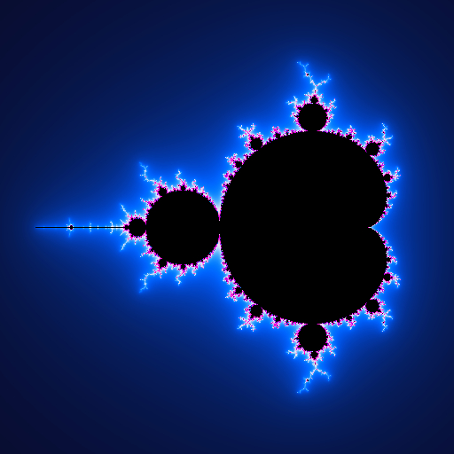
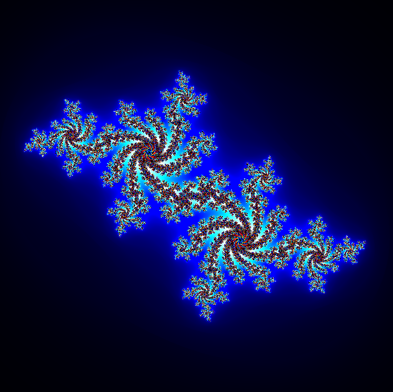
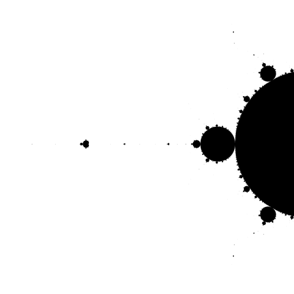
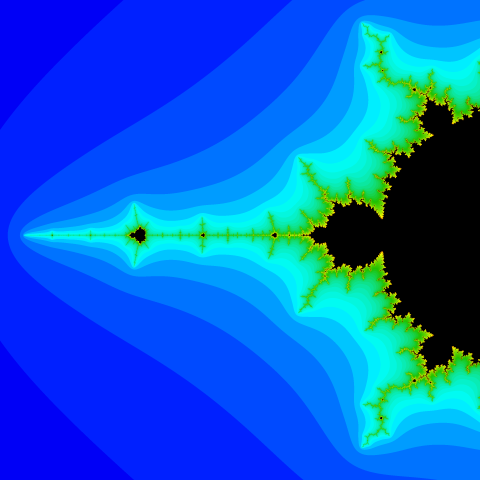

# 🌌 Fract-ol — Fractals Explorer (42 Project)

---

## 🧭 Project Overview

**Fract-ol** is a graphical and mathematical project from **42 School**. Its purpose is to explore **fractal geometry** by translating abstract mathematical formulas into real-time visual representations using **low-level C programming**.

This project is built around three core pillars:

- 🧠 **Mathematics** — complex numbers and iterative systems
- 🎨 **Graphics** — pixel-level rendering
- ⚙️ **Engineering** — performance, memory, and event handling

> Fractals are born from simple equations, yet they reveal infinite complexity.

---

# 🧮 Phase 1 — Mathematical Foundations

## 🔢 Complex Numbers

All fractals in this project are defined in the **complex plane**. A complex number is written as:

$$
z = a + bi
$$

Where:

- $a$ is the real component
- $b$ is the imaginary component
- $i^2 = -1$

📌 **Conceptual visualization**


---

## 🟣 Mandelbrot Set

The Mandelbrot set is defined by the iterative process:

$$
\begin{cases}
Z_0 = 0 \\
Z_{n+1} = Z_n^2 + C
\end{cases}
$$

- $C$ represents a point in the complex plane
- The sequence diverges when $|Z_n| > 2$

A point belongs to the Mandelbrot set if it **does not diverge** after a fixed number of iterations.

📌 **Visualization**



---

## 🔵 Julia Set

Julia sets are defined by a similar equation:

$$
Z_{n+1} = Z_n^2 + C
$$

Key difference:

- $Z_0$ is the current pixel
- $C$ is a **constant** provided by the user

Different constants generate radically different fractal shapes.

📌 **Visualization**



---

## 🎨 Smooth Coloring (Escape-Time Algorithm)

To avoid harsh color bands, the project uses **smooth coloring**.

Escape value:

$$
\mu = n + 1 - \frac{\ln(\ln |Z_n|)}{\ln 2}
$$

Normalization:

$$
t = \frac{\mu}{max\_iterations}
$$

RGB interpolation:

```c
color.r = 9   * (1 - t) * t * t * t * 255;
color.g = 15  * (1 - t) * (1 - t) * t * t * 255;
color.b = 8.5 * (1 - t) * (1 - t) * (1 - t) * t * 255;
```

📌 **Visualization**




---

# ⚙️ Phase 2 — From Mathematics to Code

## 🧩 Mapping Pixels to the Complex Plane

Each pixel $(x, y)$ of the window is mapped to a complex number $(Re, Im)$:

- Screen space → mathematical space
- Linear interpolation is used to maintain proportions

This allows zooming and panning without losing precision.

---

## 🧠 Iterative Computation

For each pixel:

1. Convert pixel to complex number
2. Iterate the fractal equation
3. Check divergence condition
4. Store iteration count
5. Compute final color

This loop is the **computational heart** of the project.

---

# 🏗️ Phase 3 — Code Architecture

## 📁 Project Structure

```
fract-ol/
├── Makefile
├── include/
│  └── fractol.h
├── src/
│  ├── fractol.c		// Parsing & program entry
│  ├── ft_fractol.c		// Core rendering loop
│  ├── ft_hook.c		// Keyboard & mouse events
│  ├── ft_init.c		// Setup
│  └── tools.c			// Utils
└── minilibx/
```

---

## 🔍 Code Walkthrough

### `fractol.c` — Program Logic

- Argument validation
- Fractal selection
- Error handling

### `ft_fractol.c` — Rendering Engine

- Pixel traversal
- Complex arithmetic
- Escape-time calculation
- Color interpolation

### `ft_hook.c` — User Interaction

- View translation
- Zoom management
- Iteration control

### `ft_init.c` — MLX Setup

- New window
- New image

### `tools.c` — Utilities

- String to double conversion
- Coordinate remapping

---

## 🎮 Controls & Interaction

The program is fully interactive and controlled via keyboard and mouse, as implemented in **ft_hook.c**.

### ⌨️ Keyboard & Mouse Controls

|	Input			|	Action				|	Technical Effect							|
|-------------------|-----------------------|-----------------------------------------------|
|	⬆️ Arrow		|	Move Up				|	Increase imaginary offset (y += 0.25 * zoom)|
|	⬇️ Arrow		|	Move Down			|	Decrease imaginary offset (y -= 0.25 * zoom)|
|	⬅️ Arrow		|	Move Left			|	Decrease real offset (x -= 0.25 * zoom)		|
|	➡️ Arrow		|	Move Right			|	Increase real offset (x += 0.25 * zoom)		|
|	🖱️ Scroll Up	 |	 Zoom In			 |	 zoom *= 0.8								 |
|	🖱️ Scroll Down	 |	 Zoom Out			 |	 zoom *= 1.25								 |
|	P				|	Increase Iterations	|	iters += 5 (max 500) — more details			|
|	M				|	Decrease Iterations	|	iters -= 5 (min 25) — faster render			|
|	ESC/Close button|	Exit				|	Destroy window and exit safely				|

📌 **Visualization**


---

# 🛠️ Phase 4 — Engineering Decisions

## ⚡ Performance Considerations

- Direct image buffer manipulation
- Minimal function overhead inside render loops
- Controlled iteration limits

## 🧠 Design Philosophy

- Clear separation between math and rendering
- Predictable data flow
- Readable and maintainable C code

This structure allows easy extension (new fractals, new coloring methods).

---

# 📦 Build

```bash
# Clone the repository
git clone https://github.com/zakariatalbi/42_fract-ol.git
cd 42_fract-ol

# Compile the project
make
```

## ▶️ Usage

```bash
make
# Examples
./fractol mandelbrot
./fractol julia -0.7 0.27015

# Help
./fractol
```

---

## 🧰 Graphics Library — MiniLibX

This project uses **MiniLibX**, a lightweight graphics library provided by 42.

🔗 Official repository: [**MiniLibX**](https://github.com/42paris/minilibx-linux.git)

Used for:

- Window creation
- Event handling
- Pixel rendering

---

## 🏁 Conclusion

**Fract-ol** is a complete journey from abstract mathematics to concrete visual output.

It demonstrates how low-level programming can transform equations into living images.

✨ *Mathematics is not only computed — it is rendered.*

---

## 🪶 Author

**Zakaria Talbi**
- GitHub: [@zakariatalbii](https://github.com/zakariatalbii)

## 📜 License

This project is part of the 42 School cursus.